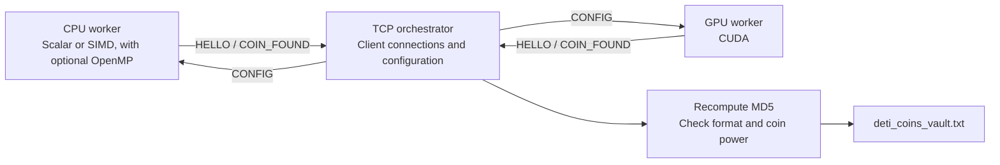

# Mining DETI Coins - From a CPU Loop to GPU Mining

A DETI coin is a 52-byte message whose MD5 hash ends in at least eight hexadecimal zeros. Finding one takes about 4.3 billion attempts on average. That makes a small search loop an interesting performance problem: how many candidates can you test with the hardware you have?

This project explores that question in C and CUDA, with SIMD instructions, OpenMP, a TCP server for collecting results from multiple machines, and a separate WebAssembly version. The original experiments ranged from roughly **9.76 million attempts per second on a single CPU thread to 4.54 billion on a GTX 1050 Mobile GPU**.

I built it with **Matilde Teixeira** in 2024 for High Performance Architectures at the University of Aveiro. We extended the supplied reference code with more search implementations, wider vectors, multicore execution, and networked mining.

[Build and command reference](DOCUMENTATION.md) · [Original project report](report.pdf) · [Assignment and reference-code description](proposal.pdf)

## Why This Problem Works Well for Comparing Hardware

The assignment gave us a fixed target: generate a message, hash it, and check the result. Each candidate can be tested independently, so there is plenty of work to distribute across vector lanes, CPU cores, and GPU threads.

The hash is only part of the cost, though. Candidates need to be generated and laid out in memory. Threads need their own search state. Results need to reach disk, sometimes through a network connection. Printing diagnostic information inside the loop can change the measurement completely.

Keeping the problem small made those costs easier to see. We could follow the same search from a scalar baseline to several forms of parallel execution and compare what each change bought us.

## What Counts as a Coin?

The format is deliberately simple:

| Bytes | Contents |
| --- | --- |
| `0–9` | The exact prefix `DETI coin `, including the final space |
| `10–50` | 41 bytes available for the search |
| `51` | A newline |

The miners use printable ASCII for the variable portion. A candidate becomes a coin when its MD5 digest ends in at least 32 zero bits. The number of trailing zero bits is its *power*; each additional zero bit doubles its value under the assignment's scoring rule.

The supplied [example coin](deti_coin_example.txt) can be checked with an ordinary command:

```console
$ md5sum deti_coin_example.txt
c0b9d8c5d2c98be1296bc13500000000  deti_coin_example.txt
```

The search changes the message until that condition holds. There is no ledger or transaction processing in the project; the coin format provides the workload for the performance experiments.

## Hashing Several Candidates at Once

The first step is SIMD: applying the same operation to several independent messages with one vector instruction.

| CPU implementation | Candidates per hash call | Search modes |
| --- | ---: | --- |
| Scalar | 1 | Single thread or OpenMP |
| AVX | 4 | Single thread or OpenMP |
| AVX2 | 8 | Single thread or OpenMP |
| AVX-512F | 16 | Single thread or OpenMP |

The important change is the memory layout. In the [AVX2 implementation](includes/avx2/md5_cpu_avx2.h), one vector holds the first 32-bit word of eight different messages. The next vector holds their second word, and so on. MD5's additions, shifts, and bitwise operations then advance all eight hashes together. The buffers are aligned to the vector width.

All these versions use the same [MD5 core](includes/md5.h) from the reference code. It is specialized for exactly 52 bytes, so the message and its padding fit in one MD5 block. Macros define how each implementation accesses data, represents constants, and rotates bits. That lets the scalar, vector, and CUDA versions share the hash rounds while changing how they execute them.

The SIMD miners give each lane a randomized printable prefix after `DETI coin `, then increment the remaining bytes like a base-95 counter, from space through `~`. When that suffix wraps, the lane gets a new random prefix. The `n_random_words` setting controls how many four-byte words are reserved for that prefix.

## Using More Than One CPU Core

SIMD handles several candidates inside one thread. OpenMP adds another level by running independent search loops across CPU threads.

In the [AVX2 OpenMP miner](includes/avx2/deti_coins_cpu_avx2_omp_search.h), each thread owns its candidate buffers, hash buffers, and counters. Each of those threads processes eight candidates per hash call. OpenMP reductions combine the attempt and coin totals when the search finishes.

Initial random generation and saving a discovered coin use critical sections. The repeated hashing stays outside those sections, so workers spend most of their time searching independently. OpenMP variants also exist for the scalar, AVX, and AVX-512 searches.

This also made the debug output useful: it can display the contents of individual lanes and show how their search states advance. It is expensive enough to matter in a benchmark, so those displays are controlled at compile time.

## Keeping the Search on the GPU

The CUDA version changes where the candidates are created. Sending every 52-byte message to the GPU and returning every hash would add transfers to a computation that produces very few useful results.

The [mining kernel](deti_coins_cuda_kernel_search.cu) builds its candidates on the device, using random bytes, thread-derived data, and a value supplied by the host. Each GPU thread tests **95 candidates per launch**. It checks the final hash word directly; only a zero value can satisfy the coin condition.

When a thread finds a coin, it uses `atomicAdd` to reserve space in a shared result buffer and writes the 13 words of the message there. The [host loop](includes/cuda/deti_coins_cuda_search.h) retrieves that small buffer, saves or forwards the coins, advances the host counter, and launches another batch.

The result buffer is just 4 KiB. Keeping candidate generation and unsuccessful hashes on the GPU is the central design decision here: the CPU receives the discoveries instead of the entire search history.

## What the Original Measurements Showed

These are the **120-second measurements from the 2024 report**. Rates below are calculated from its attempt counts.

| Implementation | Hardware | Attempts in 120 seconds | Approx. attempts/second |
| --- | --- | ---: | ---: |
| Scalar, single thread | Intel Core i7-7700HQ | 1.1715 billion | 9.76 million |
| AVX, single thread | Intel Core i7-7700HQ | 3.3672 billion | 28.06 million |
| AVX2, single thread | Intel Core i7-7700HQ | 6.1125 billion | 50.94 million |
| AVX2 + OpenMP | Intel Core i7-7700HQ | 79.936 billion | 666.13 million |
| AVX-512F, single thread | AMD Ryzen 7 7745HX | 16.198 billion | 134.98 million |
| CUDA | NVIDIA GeForce GTX 1050 Mobile | 544.59 billion | 4.54 billion |

On the same CPU, the single-threaded AVX2 search made about **5.2 times as many attempts as the scalar baseline**. The AVX-512 run used a different machine, so it also reflects a hardware change. The OpenMP figure comes from the report's separate debug-build comparison; the report does not record its thread count.

That comparison measured 13.559 billion attempts with debugging enabled and 79.936 billion without it. The makefile changes both diagnostic output and optimization level (`-O0` versus `-O2`), so the difference cannot be attributed to printing alone.

These are historical search measurements, not results from the built-in `-t` hash microbenchmark. Attempt counters also count work performed, including any repeated candidates. The [measurement notes](DOCUMENTATION.md#interpreting-the-measurements) explain the distinction.

## Putting a Message Inside a Coin

The [special AVX2/OpenMP search](includes/avx2/deti_coins_cpu_avx2_omp_special_search.h) preserves a user-provided string immediately after `DETI coin `. It adds four random bytes and searches through the remaining suffix. When that suffix is exhausted, it regenerates the random bytes while keeping the requested text intact.

This introduces a useful tradeoff: longer text leaves less room for the counter and causes more frequent reinitialization.

In the report's 120-second tests, searching with `AAD!` reached about **75.38 billion attempts**. With `Arquiteturas Alto Desempenho 24/25!!`, it reached about **713 million**. That second string occupies all 36 available bytes, leaving just one counter byte after the four random bytes: each lane needs a new random value after only 95 candidates. The hash condition stayed the same; changing the candidate format changed how much work was spent maintaining the search state.

The mode accepts up to 36 bytes of text for the supported format and works both locally and as a network client.

## Collecting Coins from Several Machines

The TCP mode lets machines use different mining implementations while reporting to the same server. A CPU worker can run AVX2 with OpenMP while another machine uses CUDA.



The protocol has three messages. `HELLO` identifies the client's hostname, mining backend, and OpenMP thread count. `CONFIG` returns the server's `n_random_words` setting. `COIN_FOUND` carries a discovered message back to the server.

The server handles connections with pthreads and uses the vault code to recompute each submitted coin's hash before storing it. Workers perform the search locally; the network is used for setup and discoveries.

This is a basic collector for distributed execution. It does not assign disjoint search ranges, and identical clients can repeat work. Work allocation and synchronization around the server's shared vault are the first things I would revisit before using it for longer runs across multiple machines.

## Running the Same Idea in a Browser

The [WebAssembly version](deti_coins_webassembly.c) is a separate scalar C program compiled with Emscripten. It runs a fixed number of attempts and prints the coins and timing information in the generated page.

The report records one billion attempts in **57.860 seconds in Zen Browser on a Ryzen 7 5800H**, and **148.109 seconds on a Google Pixel 8**. Those runs explored how the same small workload behaved on a laptop and a phone. The committed source is configured for 700 million attempts, so reproducing that comparison requires changing the constant first.

This version is independent of the TCP workers and the native vault. Its search runs synchronously, without a Web Worker or a separate browser interface.

## Trying It Locally

On a Linux machine with AVX2 support, GCC, Make, and `md5sum`, run these commands from the repository root:

```bash
make deti_coins_intel
./deti_coins_intel -t
OMP_NUM_THREADS=4 ./deti_coins_intel -s5 2m 1
```

The last command runs the AVX2/OpenMP miner with four threads for two minutes. Discovered coins are appended to `deti_coins_vault.txt` when the search finishes. A timed run may find no coins; the output includes both the attempt count and the expected number of discoveries.

The `-t` command first checks scalar hashes against `md5sum`, then compares the enabled vector implementations against scalar results over 1,048,576 generated messages. It also reports time per hash.

See [DOCUMENTATION.md](DOCUMENTATION.md) for the complete mode table, custom-text search, CUDA and WebAssembly builds, network setup, and implementation limits. The repository includes a NEON hash routine, but its mining mode is not connected in this snapshot.

## Finding Your Way Around the Code

| Location | What to look for |
| --- | --- |
| [deti_coins.c](deti_coins.c) | CLI, timed execution, enabled backends, and hash checks |
| [includes/md5.h](includes/md5.h) | Shared MD5 rounds specialized for 52-byte messages |
| [includes/avx2/](includes/avx2/) | Eight-lane hashing, local search, OpenMP, and custom-text mining |
| [includes/avx512/](includes/avx512/) | Sixteen-lane hashing and search |
| [deti_coins_cuda_kernel_search.cu](deti_coins_cuda_kernel_search.cu) | Candidate generation and result collection on the GPU |
| [includes/orchestration/](includes/orchestration/) | TCP client and server |
| [includes/deti_coins_vault.h](includes/deti_coins_vault.h) | Coin verification, power calculation, and buffered storage |
| [deti_coins_webassembly.c](deti_coins_webassembly.c) | Standalone browser experiment |

The project builds on reference code provided by **Tomás Oliveira e Silva**, including the specialized MD5 core, scalar miner, AVX and NEON hash routines, CUDA hashing example, and verification utilities. The [original assignment](proposal.pdf) identifies that starting point; the [report](report.pdf) records the implementations and experiments developed by **Miguel Vila and Matilde Teixeira**.
